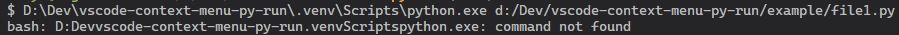
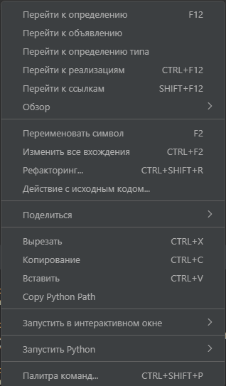
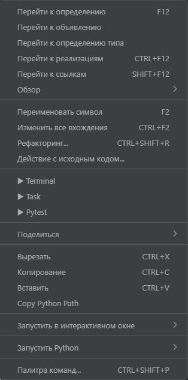

# Run Python

## Overview.

The Run Python extension for VsCode allows you to run the current file in the terminal, run the file as a task, and run Pytest on the current file. The Python extension does [not support](https://github.com/microsoft/vscode-python/issues/24717#issuecomment-2587434386) Git Bash, which causes problems when 
 [activating](https://github.com/microsoft/vscode-python/issues/23382) and 
 [running files](https://github.com/microsoft/vscode-python/issues/22434).
There is also a problem with finding tests in nested folders, so a task has been added to run pythest on the current file.

> Important: This extension currently requires the of the Python extension (ms-python.python) to operate.

## Problems
 

## Screenshots

| Before | After |
| --- | --- |
|  |  |
